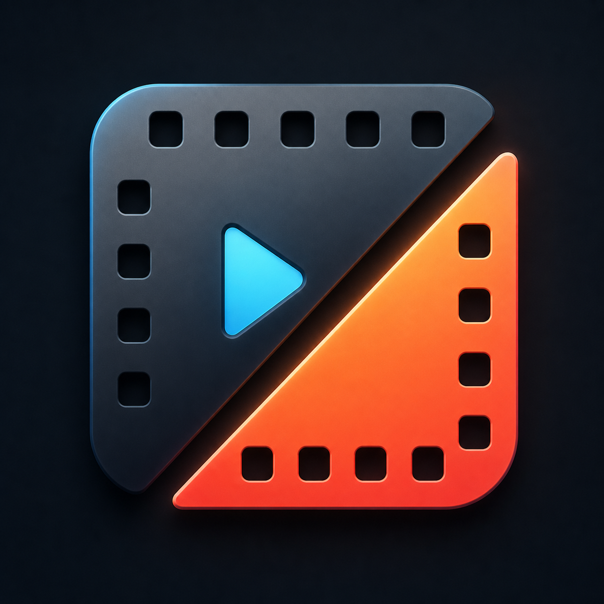
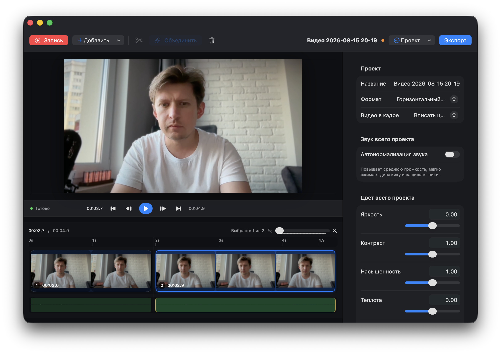
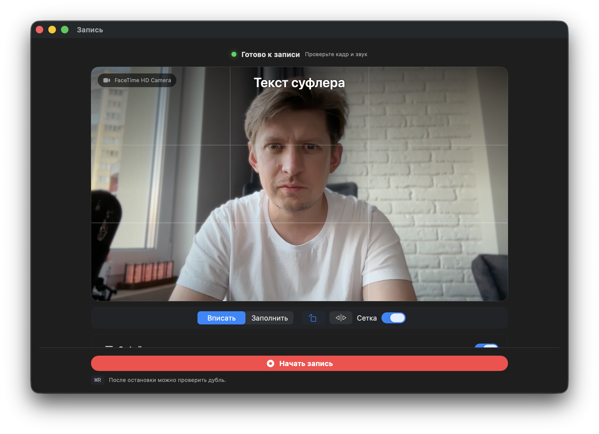

<p align="center">
  
</p>

<h1 align="center">SimpleCut</h1>

<p align="center">
  <strong>Записывайте, монтируйте и публикуйте видео — в одном простом приложении для macOS.</strong>
  <br>
  Камера и суфлёр, быстрый монтаж, локальные автосубтитры и экспорт до 4K.
</p>

<p align="center">
  <a href="https://github.com/alexyar88/simplecut/releases/latest/download/SimpleCut-macOS.dmg"></a>
  <a href="https://web.tribute.tg/d/ONV"></a>
</p>

<p align="center">
  macOS 14+ · интерфейс на русском · обработка видео на вашем Mac
</p>



## От записи до готового ролика без лишней сложности

SimpleCut создан для тех, кому нужно быстро выпустить видео, а не изучать
профессиональный комбайн. Запишите себя прямо в приложении или добавьте готовые
файлы, уберите лишнее, оформите ролик и экспортируйте MP4 для YouTube, Shorts,
Reels или других площадок.

- **Запись с камерой и суфлёром.** Выберите камеру и микрофон, настройте кадр по
  сетке и говорите по подготовленному тексту.
- **Монтаж на наглядном таймлайне.** Разрезайте и переставляйте клипы, меняйте
  границы фрагментов и удаляйте паузы. Waveform помогает ориентироваться по
  звуку, а undo/redo — спокойно экспериментировать.
- **Автосубтитры без отправки речи в облако.** WhisperKit расшифровывает звук
  локально. Готовые фразы можно исправлять, перемещать и оформлять прямо в
  проекте.
- **Форматы под разные площадки.** Горизонтальный 16:9, вертикальный 9:16 или
  квадратный 1:1 — с режимами вписывания и заполнения кадра.
- **Чистый звук и аккуратный цвет.** Автонормализация громкости, защита пиков,
  базовая цветокоррекция и Auto Enhance.
- **Экспорт без сюрпризов.** H.264 или HEVC, 24/30/60 fps и разрешение от 720p
  до 2160p. Текст, изображения и субтитры попадут в итоговое видео.

## Записывайте сразу в нужном кадре



Перед записью можно выбрать доступную камеру, включая внешние устройства и
Continuity Camera, проверить композицию по сетке и вывести текст суфлёра поверх
превью. После остановки дубль сразу готов к просмотру и монтажу.

## Скачать и установить

> [!IMPORTANT]
> Сейчас приложение распространяется бесплатно, но DMG ещё не подписан
> сертификатом Apple Developer ID и не нотариализован. Поэтому при первом
> запуске macOS покажет предупреждение. Это ограничение текущего способа
> распространения, а не ошибка установки.

1. **[Скачайте актуальный SimpleCut-macOS.dmg](https://github.com/alexyar88/simplecut/releases/latest/download/SimpleCut-macOS.dmg).**
2. Откройте DMG и перетащите `SimpleCut` в папку `Applications` («Программы»).
3. В Finder откройте `Applications`, нажмите на `SimpleCut` с зажатой клавишей
   <kbd>Control</kbd> и выберите **«Открыть»**.
4. В появившемся окне ещё раз нажмите **«Открыть»**. В дальнейшем приложение
   запускается обычным двойным кликом.

Если кнопки **«Открыть»** нет, один раз попробуйте запустить приложение, затем
перейдите в **Системные настройки → Конфиденциальность и безопасность**, найдите
сообщение о SimpleCut и нажмите **«Всё равно открыть»**.

Нужен другой вариант загрузки?

- [ZIP-архив и все файлы последнего релиза](https://github.com/alexyar88/simplecut/releases/latest)
- [Контрольные суммы SHA-256](https://github.com/alexyar88/simplecut/releases/latest/download/SHA256SUMS.txt)

## Как начать

1. Нажмите **«Запись»**, чтобы снять новый материал, или **«Добавить»**, чтобы
   импортировать несколько видео.
2. Выберите формат проекта: 16:9, 9:16 или 1:1.
3. Соберите ролик на таймлайне, добавьте текст, изображения или автосубтитры и
   при необходимости поправьте звук и цвет.
4. Нажмите **«Экспорт»**, выберите кодек, разрешение и частоту кадров — SimpleCut
   сохранит готовый MP4 в указанную папку.

Проекты сохраняются как переносимые пакеты `.simplecut`. Автовосстановление
защитит несохранённые изменения, если работа приложения была прервана.

## Локальные автосубтитры

В инспекторе выберите язык и модель речи, затем нажмите **«Создать субтитры»**.
При первом использовании SimpleCut скачает быструю Base или более точную Large
v3 модель в `Application Support/SimpleCut/Models`. После загрузки распознавание
выполняется на устройстве. Каждый созданный блок доступен на таймлайне и
редактируется как обычный текст.

## Поддержать SimpleCut

SimpleCut развивается как независимый проект. Если приложение сэкономило вам
время или помогло выпустить ролик, поддержка поможет уделять больше времени
исправлениям, новым функциям и будущей подписи приложения для более простой
установки.

<p align="center">
  <a href="https://web.tribute.tg/d/ONV"></a>
</p>

Даже если донат сейчас не входит в планы, вы можете помочь проекту: поставьте
звезду репозиторию и расскажите о SimpleCut тем, кому нужен простой видеоредактор
для Mac.

<details>
<summary><strong>Сборка из исходного кода</strong></summary>

### Требования для разработки

- macOS 14 или новее;
- полный Xcode с совместимым macOS SDK;
- Swift 6.1 или новее.

Собрать переносимое приложение с локальной ad-hoc подписью:

```sh
./Scripts/package-app.sh
open build/SimpleCut.app
```

Также можно открыть `Package.swift` в Xcode и запустить executable target
`SimpleCut`.

Запустить тесты:

```sh
swift test
```

Интеграционный тест локальной транскрибации синтезирует речь, при необходимости
скачивает Base-модель и проверяет настоящий Core ML-инференс:

```sh
SIMPLECUT_RUN_MODEL_TEST=1 swift test \
  --filter testLocalTranscriptionWhenEnabled
```

</details>

<details>
<summary><strong>Релизы, подпись и notarization</strong></summary>

После каждого успешного push в `main` GitHub Actions запускает сборку и тесты,
а затем публикует новый GitHub Release с DMG, резервным ZIP-архивом и
контрольными суммами.

`package-app.sh` создаёт sandboxed-приложение с локальной ad-hoc подписью. Для
notarization сначала сохраните учётные данные через `notarytool`:

```sh
xcrun notarytool store-credentials SimpleCut
SIMPLECUT_NOTARY_PROFILE=SimpleCut ./Scripts/notarize-app.sh
```

Для релиза без предупреждения Gatekeeper ad-hoc подпись в `package-app.sh`
нужно заменить на сертификат Developer ID Application.

</details>

---

<p align="center">
  <a href="https://github.com/alexyar88/simplecut/releases/latest/download/SimpleCut-macOS.dmg"><strong>Скачать SimpleCut</strong></a>
  ·
  <a href="https://github.com/alexyar88/simplecut/issues">Сообщить о проблеме</a>
  ·
  <a href="https://web.tribute.tg/d/ONV">Поддержать проект</a>
</p>
